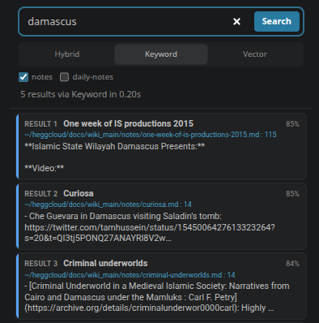

A famous economics [joke](https://barrypopik.com/blog/if_it_were_a_real_20_bill) poking fun at the efficient markets hypothesis ends with the senior professor refusing to acknowledge a $20 bill on the ground because "if it was there somebody would have picked it up already". So it is with software; usually there's no point making a new tool, because what you are looking for has likely already been built.

But every once in a while, perhaps a couple of times a year, I come across a need that hasn't been met by the efficient market of open source software. Previously I just found a suboptimal workaround and moved on. But with LLM agents I can now vibecode almost anything I want. As many have pointed out, we are in an era of almost limitless customisation. 

One my agents' most useful creations recently was a VSCode extension to provide a GUI for the command-line search tool [`qmd`](https://github.com/tobi/qmd). It is designed to provide agents with efficent search in large collections of Markdown documents and does a terrific job at that, as its nearly 30k stars on GitHub suggest. I have a lot of notes in Markdown, and I have long been unhappy with the built-in search functionality in [VSCodium](https://vscodium.com), my text editor of choice. So I just asked an agent to build me a VSCode extension that would provide more user-friendly search with `qmd` as the backend. It took us about half an hour, with the agent doing all the work and me just asking for tweaks in natural language. Now I have search in a VSCode sidebar that actually lets me find things. I can choose between keyword and semantic search, I can modify the format of the results, and, obviously, clicking a result opens the file in question.

If you're a VSCode/VSCodium user you can try for yourself by downloading the `vsix` file from [here](https://github.com/Hegghammer/qmd-search). You will need to set up `qmd` first and index at least one collection.

It's probably a stretch to say that agents allow anyone to build anything. It helps to have some programming literacy and an understanding of the domain in which the tool is going to operate. In my case, VSCodium was a platform I was very familiar with, so I knew what tweaks I could reasonably ask the agent for. But if you have that minimum literacy, it really is a new world. 

