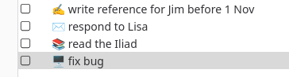

This is not really a TIL because I knew about it. But I just thought of some new use cases, and I figured I could use the occasion to inaugurate a new `#deadsimple` tag.

It's the simple idea that emojis are Unicode, so if you keep a plaintext workflow or otherwise like to keep things simple, you can use emojis as a type of tag. For instance, most file explorers lets you create shortcuts in the left sidebar, and you can use emojis to make them more distinguishable from one another. Instead of "documents" and "photos" you can have "📄 documents" and "📷 photos".

What prompted my latest aha moment was something a bit more niche: Tasks in [Thunderbird](https://www.thunderbird.net). I use [CalDav Tasks](https://tasks.org/docs/sync_caldav/) for my todo lists (so they sync easily across devices), and on PCs I manage them in Thunderbird. But Thunderbird's task list is so minimalistic it provides no highlighting unless you use a separate calendar for every category. Then I realised I can just use emojis as tags and keep everything in one "tasks" calendar. 

It's the same idea that powers [Obsidian tasks](https://community.obsidian.md/plugins/obsidian-tasks-plugin), probably the most widely used plaintext todo standard after [GFM tasks](https://github.github.com/gfm/#example-279). Instead of bothering with ASCII syntax like that of [todo.txt](http://todotxt.org), it just uses emojis.

I am sure there are many other creative ways one can use emojis in a plaintext workflow. Just dont't use them in file or folder names; it will complicate search and programmatic file handling. 
